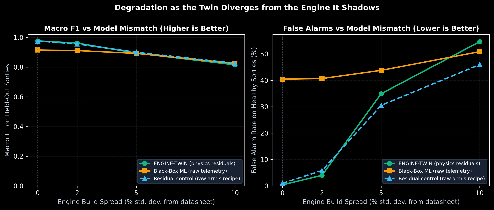

# EngineTwin

A real-time digital twin for the aero piston engines that power medium-altitude
long-endurance UAVs. It runs a physics model of the engine alongside the engine
itself, compares the two continuously, and hands the difference to a small stack
of neural networks that decide what is wrong, how bad it is, how long you have,
and why it thinks so.

Everything in this repository is simulated — the engine, the probes, and the
failures. There is no flight hardware in the loop. What is real is the pipeline:
the physics model, the estimator, the diagnostic networks, the explanations, and
the validation suites that measure them.

---

## Why threshold alarms fail at 28,000 ft

A conventional engine instrument system watches each channel against a fixed
redline. On a light aircraft that flies at 8,000 ft all day, that works. On a
MALE UAV climbing from sea level to 30,000 ft on a 20-hour sortie, it fails in
both directions at once.

Climb high enough and a *healthy* engine starts looking sick. Manifold pressure
falls as the turbo runs out of air, power derates from 200 HP to 110 HP, EGT
drifts. Nothing is broken; the atmosphere changed. A fixed threshold reads this
as a fault, and the operator learns to ignore it.

Meanwhile a genuinely failing engine can sit comfortably inside every redline.
An injector clogging on cylinder 3 pushes EGT₃ up by 40 °C — well under the
880 °C continuous limit, so nothing trips, right up until it does.

The trap is that a raw sensor reading carries two things at once: the state of
the engine, and the state of the flight. You cannot threshold your way out of
that, and a black-box model trained on raw telemetry inherits the same problem —
it just hides it behind a confidence score.

## The idea

Separate the two. Run a Mean Value Engine Model in lockstep with the engine, fed
the same altitude, ambient conditions and throttle. It predicts what a *healthy*
engine would be doing right now. Then diagnose on the gap, normalized per
channel:

```
r  =  (y_measured − y_physics) / σ_channel
```

Fifteen channels, one vector:

```
rpm  manifold_pressure  fuel_flow  oil_pressure  oil_temp
cht_cyl_1..4     egt_cyl_1..4     vibration_rms     bus_voltage
```

Because the physics baseline already absorbed altitude, throttle and ambient
temperature, a healthy engine sits at `r ≈ 0` everywhere in the envelope — sea
level or 30,000 ft, idle or full power. The learning problem stops being
"recognise this engine" and becomes "recognise a departure from physics," which
is a much smaller problem and a far more transferable one.

Every model downstream sees residuals. None of them ever sees a raw sensor value.

---

## Running it

You need Python 3.10 or 3.11 and a browser with WebGL.

```bash
git clone https://github.com/Arman0212/UAV-EngineTwin.git
cd UAV-EngineTwin

python -m venv .venv
source .venv/bin/activate          # Windows: .venv\Scripts\activate
pip install -r requirements.txt

python main.py
```

The launcher opens <http://127.0.0.1:8000> for you. On Windows, `run_demo.bat`
does the same thing with a double-click.

**No internet is required to run it.** Tailwind, Chart.js, Three.js, OrbitControls
and the webfont are all vendored under [`dashboard/vendor/`](dashboard/vendor/)
and served from the twin's own host, because a ground station that loses its
charts and its 3D view when the venue WiFi is blocked is not a ground station.
[`tools/fetch_vendor_assets.py`](tools/fetch_vendor_assets.py) refreshes those
copies and is the only script in the project that reaches the network.

If FastAPI and Uvicorn are missing, `main.py` quietly falls back to
[`standalone_server.py`](standalone_server.py), which serves the whole twin on
the standard library alone. NumPy and PyTorch are still needed for the physics
and the networks.

To confirm the install is sound:

```bash
python run_all_tests.py
```

Nine suites, one consolidated report — physics, AI layer, end-to-end fault
propagation, leakage audit, stress testing, baseline comparison, ablation,
multi-engine transfer, and edge profiling. Every suite exits non-zero on failure,
including the fault-propagation QA, so a green run means all nine actually
passed. Allow about two and a half minutes; the ablation retrains four networks.

---

## Five minutes at the console

The dashboard is worth driving rather than reading about. In order:

**1 — Watch it idle.** The aircraft is in high-altitude loiter. Health sits at
100 %, the 3D engine is cool, and every telemetry strip shows the measurement
tracking the physics baseline inside its ±3σ band. Note that the absolute
numbers look nothing like sea-level numbers, and nothing complains.

**2 — Break the oil system.** Hit `Oil Pressure Loss`. Roughly two seconds
later the autoencoder trips, the classifier names `OIL_PRESSURE_LOSS`, oil
health collapses, the sump glows red on the 3D view, and the alert reads
*Return To Base* with a remaining-life interval attached.

**3 — Now break a sensor instead.** Reset, then hit `Probe Defect (EGT3)`.
EGT₃ falls toward ambient. This is the case a redline system aborts a perfectly
good aircraft over. EngineTwin checks EGT₃ against CHT₃ and fuel flow, finds the
neighbours entirely nominal, and reports *sensor probe defect — engine healthy*.
Health barely moves. The mission continues.

**4 — Ask it why.** Hit `Bearing 2X Vib` and open the evidence drawer. The
diagnosis comes with its attribution: which residual channels drove it, in
what proportion, and an inspection window in flight hours rather than a bare
percentage.

**5 — Land, then debrief.** Hit `Debrief`. Every sortie since the server started
has been written to disk by the flight data recorder. Pick one and the panel
shows its post-flight report: time spent in each health band and mission phase,
per-subsystem health minima, the fault timeline with the residual channels that
drove each diagnosis, and the gap between the unsupervised trigger firing and the
classifier committing to a name. Hit `Replay` and the sortie streams back through
the same telemetry path the live twin uses — the whole dashboard, 3D view
included, replays without knowing the difference.

**6 — Fly it yourself.** Hit `Sandbox`, switch to manual, and drag altitude from
sea level to 30,000 ft at full throttle. Power derates 200 HP → 110 HP and
manifold pressure falls 2.38 → 1.54 bar, exactly the published VRDE curve. Health
stays at 100 % and the diagnosis stays `HEALTHY` the whole way. That is the
argument in one gesture: every one of those readings would trip a fixed redline.

[`tools/auto_demo_showcase.py`](tools/auto_demo_showcase.py) runs the fault
sequence unattended if you need it hands-free.

---

## What happens in one 50 ms tick

The service loop in [`engine_service.py`](engine_service.py) does this twenty
times a second:

1. **Flight profile** advances — ISA atmosphere gives ambient pressure and
   temperature for the current altitude, and the mission phase sets throttle.
   Phases run `TAXI_WARMUP → CLIMB_TO_ALTITUDE → HIGH_ALT_LOITER → DESCENT →
   APPROACH_LANDING`.
2. **MVEM integrates** — manifold filling dynamics, turbo boost with altitude
   derating, crankshaft torque balance, four independent cylinder thermal
   states, and the oil circuit. This is ground truth.
3. **Faults are applied**, if any are active, as parametric perturbations of
   the physics or the instrumentation.
4. **Sensors sample** the truth through per-channel noise, first-order lag,
   ADC quantization and sample rate. EGT probes are slow and coarse (σ = 3.5 °C,
   τ = 2.0 s, 5 Hz); the RPM pickup is fast and clean (σ = 8 rpm, τ = 0.05 s,
   50 Hz).
5. **The state estimator** fuses the measurement into a 12-state estimate. If the
   datalink drops packets, it coasts on the physics baseline instead of producing
   a spurious residual spike. It is a linear Kalman filter with a
   complementary prediction step, not an EKF — see the note below.
6. **Residuals** are computed and handed to everything downstream.
7. **Health indices** map residuals to bounded 0–100 % scores per subsystem.
8. **Anomaly trigger** — the autoencoder reconstructs the residual vector. If
   the error clears `mean + 3σ` of the healthy calibration distribution, the
   rest of the stack wakes up. Otherwise the tick ends here.
9. **Sensor validator** decides, before anything else runs, whether this is a
   bad probe or a bad engine.
10. **Classifier** returns a calibrated fault class and a continuous severity.
11. **Attribution and RUL** attach the evidence and the remaining-life interval.
12. **Broadcast** — the full twin state goes out over the WebSocket, and the same
    frame is appended to the sortie log by the flight data recorder.

Budget is 150 ms. The whole chain costs about 1 ms of CPU. No GPU.

---

## The code

**Physics and environment** — [`simulation/`](simulation/)

- [`mvem.py`](simulation/mvem.py) — the Mean Value Engine Model, calibrated to a
  DRDO/VRDE-class 2.2 L four-cylinder turbocharged aero-diesel
- [`sensors.py`](simulation/sensors.py) — datasheet-driven instrumentation model
- [`flight_profile.py`](simulation/flight_profile.py) — ISA atmosphere and MALE
  mission profiles
- [`fault_injector.py`](simulation/fault_injector.py) — parametric failure modes

**Twin state** — [`digital_twin/`](digital_twin/)

- [`state_estimator.py`](digital_twin/state_estimator.py) — 12-state
  physics-anchored Kalman estimator over `[RPM, MAP, Oil_P, Oil_T, CHT₁₋₄, EGT₁₋₄]`
- [`flight_recorder.py`](digital_twin/flight_recorder.py) — flight data recorder
  and post-flight analysis: every sortie to JSONL, replayable and reportable
- [`health_index.py`](digital_twin/health_index.py) — subsystem scoring as
  `100·exp(−α·|r|)`, weighted into an overall index, banded
  `NOMINAL / ADVISORY / CAUTION / WARNING / CRITICAL` at 85 / 70 / 50 / 25
- [`twin_state.py`](digital_twin/twin_state.py) — the engine represented at five
  levels simultaneously: physical truth, raw sensor, filtered estimate, healthy
  baseline, and AI health layer

**Diagnosis** — [`models/`](models/)

- [`anomaly_autoencoder.py`](models/anomaly_autoencoder.py) — symmetric
  bottleneck `15→32→16→6→16→32→15`, trained only on healthy residuals, so it
  flags failure modes that are not in the taxonomy at all
- [`sensor_validator.py`](models/sensor_validator.py) — cross-channel
  thermodynamic consistency; separates instrumentation faults from engine faults
- [`fault_classifier.py`](models/fault_classifier.py) — shared `15→64→32`
  backbone, a 10-class head with learned temperature scaling, and a continuous
  severity head
- [`rul_estimator.py`](models/rul_estimator.py) — classifies degradation as
  `STABLE / DRIFTING / ABRUPT` over a 50-sample window, projects to the 30 %
  critical threshold, and reports a 95 % interval in flight hours

**Explanation** — [`xai/`](xai/)

- [`attribution.py`](xai/attribution.py) — gradient × input attribution over the
  15 residual channels, under a millisecond
- [`alert_generator.py`](xai/alert_generator.py) — assembles diagnosis, physics
  evidence, life interval and sensor integrity into one operator card with an
  explicit directive

**Everything else** — [`dashboard/`](dashboard/) is the ground station (3D
engine view, telemetry strips, health matrix, evidence drawer, fault control
pad). [`validation/`](validation/) holds the benchmark, ablation, leakage audit
and stress suites. [`tools/`](tools/) has profiling, plotting and transfer
utilities. [`configs/`](configs/) holds the engine parameter sets.
[`ENGINE_TWIN_MASTER_PIPELINE.ipynb`](ENGINE_TWIN_MASTER_PIPELINE.ipynb) walks
the whole thing end to end in one notebook.

**Two naming corrections, stated up front.** The state estimator is a *linear*
Kalman filter whose prediction step blends toward the MVEM's own integrated
state — there is no non-linear transition function and no Jacobian, so calling it
an EKF would be wrong. And the attribution is *gradient × input*, not Shapley
values; it gives a defensible ranking, not an additive decomposition with
SHAP's guarantees. Both modules say so in their docstrings, at length. They work
well and are the right engineering choice for a 50 ms edge budget; they just are
not the things those two acronyms name.

**Temperature scaling deserves a note.** An uncalibrated network will report
99 % confidence on a marginal case, and an operator who learns that the number
is inflated stops using it. The classifier divides its logits by a learned
temperature so the reported confidence means something. This is a human-factors
decision as much as a modelling one.

---

## Fault library

Ten classes, each injectable at any severity and ramp rate:

| Class | Mechanism | What shows up in the residuals |
|:--|:--|:--|
| `HEALTHY` | — | `r ≈ 0` everywhere |
| `LEAN_MIXTURE_CYL3` | Injector partially clogged | EGT₃ climbs, thermal gradient tilts |
| `RICH_MIXTURE_CYL1` | Injector leaking | EGT₁ drops while fuel flow rises |
| `COOLING_DEGRADATION_CYL2` | Baffle or airflow blockage | CHT₂ rises fast |
| `OIL_PRESSURE_LOSS` | Relief valve leak | Oil pressure below 2.0 bar |
| `TURBO_BOOST_DEFICIENCY` | Wastegate stuck / compressor fouling | MAP deficit, worse with altitude |
| `CYLINDER_MISFIRE_TIMING` | Timing jitter, valve seating | RPM instability, 0.5× vibration order |
| `BEARING_WEAR_VIBRATION` | Crank or rod bearing wear | 2× vibration growing over time |
| `SENSOR_FAULT_EGT3` | Thermocouple open circuit | EGT₃ at ambient, engine untouched |
| `ELECTRICAL_VOLTAGE_SAG` | Alternator diode fault | Bus voltage sags under avionics load |

`SENSOR_FAULT_EGT3` is a first-class member of the taxonomy on purpose. The
system is *trained* to tell a dead probe from a dead cylinder rather than
inferring it from a heuristic afterwards, because that particular confusion is
what turns a healthy aircraft into an aborted sortie.

---

## Driving it from your own code

The service listens on `127.0.0.1:8000`.

| | Endpoint | |
|:--|:--|:--|
| `GET` | `/` | the dashboard |
| `GET` | `/api/state` | full twin state, once |
| `POST` | `/api/fault/inject` | inject a fault |
| `POST` | `/api/fault/clear` | back to healthy |
| `POST` | `/api/flight/override` | manual throttle / altitude / OAT |
| `POST` | `/api/sim/reset` | restart from t = 0 |
| `POST` | `/api/sim/speed` | time scale, clamped 0.2×–10× |
| `GET` | `/api/sessions` | recorded sorties, newest first |
| `GET` | `/api/sessions/{id}` | post-flight report for one sortie |
| `GET` | `/api/sessions/{id}/frames` | raw recorded frames, paged |
| `POST` | `/api/replay/start` | replay a sortie through the live stream |
| `POST` | `/api/replay/stop` | back to live telemetry |
| `WS` | `/ws/telemetry` | 20 Hz state broadcast |
| `GET` | `/api/stream` | same broadcast over SSE |

The twin runs on its own background task, so sortie time advances whether or not
a browser is attached, `/api/state` is populated immediately, and a second
dashboard tab observes the same sortie rather than stepping it a second time.

Injecting a fault takes a class name, a severity in 0.0–1.0, and a ramp time in
seconds (`0` for an abrupt step). An unknown class returns HTTP 400.

```bash
curl -X POST http://127.0.0.1:8000/api/fault/inject \
  -H "Content-Type: application/json" \
  -d '{"fault_type": "TURBO_BOOST_DEFICIENCY", "severity": 0.7, "ramp_duration_s": 12.0}'
```

Reading the stream:

```python
import asyncio, json, websockets

async def listen():
    async with websockets.connect("ws://127.0.0.1:8000/ws/telemetry") as ws:
        while True:
            s = json.loads(await ws.recv())
            ai = s["ai_prognostics"]
            print(f'{s["timestamp_s"]:7.1f}s  {s["altitude_ft"]:6.0f}ft  '
                  f'health {s["health"]["overall_health"]:5.1f}%  '
                  f'{ai["fault_class"]} @ {ai["fault_confidence_pct"]:.0f}%  '
                  f'RUL {ai["rul_hours_min"]:.0f}-{ai["rul_hours_max"]:.0f}h')

asyncio.run(listen())
```

Each frame carries the flight state, the raw sensor channels, the MVEM
expectation for each of them, the filtered estimate, the residual vector, seven
health scores, and the AI block (anomaly score and threshold, fault class,
calibrated confidence, severity, sensor-fault flag, RUL mean and bounds, top
contributing channels, and a recommended action). The full schema is
[`digital_twin/twin_state.py`](digital_twin/twin_state.py).

---

## Data and training

Three CSVs in [`data/datasets/`](data/datasets/), all generated from the
calibrated MVEM by [`generate_dataset.py`](data/generate_dataset.py). Each row
carries 39 columns: flight state, every sensor channel, physics ground truth
(`true_power_hp`, `true_torque_nm`, `true_bsfc_g_kwh`), labels, and provenance.

| File | Sorties | Rows | Used for |
|:--|--:|--:|:--|
| `train_healthy.csv` | 10 | 18,000 | autoencoder training and σ calibration |
| `train_faults.csv` | 36 | 64,800 | classifier and severity head |
| `test_scenarios.csv` | 32 | 48,000 | held-out evaluation |

**Every sortie is an independent mission.** The mission *shape* — cruise ceiling,
loiter altitude and band, throttle settings, and the fraction of the sortie spent
in each phase — is drawn per run, on top of an ISA offset and a per-run seed. The
held-out shapes come from a separate RNG stream with deliberately *wider* ranges
than training (ceilings 22,000–32,000 ft against 24,000–30,000 ft), so the test
set probes generalisation rather than replaying one mission under new noise. Each
fault class gets four independent training sorties and three held-out ones.

Splits are partitioned by `run_id` — whole flights, never individual rows. That
distinction matters: split by row and adjacent 50 ms samples land on both sides
of the boundary, and your test accuracy becomes fiction.
[`validation/leakage_audit.py`](validation/leakage_audit.py) checks `run_id`
overlap, temporal integrity, class representation, and runs a nearest-neighbour
search in standardised telemetry space to confirm no held-out frame is a
near-duplicate of a training frame (closest approach on the committed data:
0.126 σ, median 0.340 σ).

Note that `data/generate_dataset.py` is the *only* thing that rewrites the
committed CSVs. The test suite generates into a temporary directory, because
overwriting them mid-run would silently leave the shipped checkpoints scored
against data they were never trained on.

Rebuild the data with `python data/generate_dataset.py`. Retrain with
`python train_and_export_models.py`, which trains both networks, calibrates the
anomaly threshold and the classifier temperature, scores precision, recall,
detection latency and false-alarm rate on the held-out scenarios, and writes
checkpoints to `models/saved_models/`.

---

## How well it works

Measured on 48,000 held-out frames from 32 independent sorties, spanning takeoff
through 32,000 ft loiter and back down. Reproduce with `python validation/benchmark.py` — it
prints this table itself.

| | Fixed-threshold EIS | Black-box ML on raw telemetry | **EngineTwin** |
|:--|:---:|:---:|:---:|
| Accuracy | 53.65 % | 86.93 % | **97.64 %** |
| Macro F1 | 0.2463 | 0.8696 | **0.9770** |
| Detection latency | 28.26 s | 8.00 s | **2.87 s** |
| False alarms on healthy sorties | 0.00 % | 11.74 % | **1.42 %** |
| CPU inference | 0.035 ms | 0.001 ms | **0.397 ms** |
| Sensor vs. engine | false abort | confounded | **decoupled** |
| Root cause | none | feature importance | **attribution cards** |
| RUL bounds | none | none | **trend interval** |

Two columns need reading carefully. The EIS scores a perfect 0.00 % false-alarm
rate, which sounds excellent until you notice its macro F1 is 0.25 — the
thresholds are set so wide that it misses nearly everything real. The black-box
model has the opposite problem: strong in-distribution accuracy, and an 11.74 %
false-alarm rate because high-altitude telemetry looks anomalous to a model with
no physics baseline for derating.

[`validation/ablation.py`](validation/ablation.py) isolates that effect directly,
by training the *same* network on raw channels instead of residuals and scoring
both on the same held-out sorties:

| Configuration | Macro F1 | False alarms | Accuracy |
|:--|:---:|:---:|:---:|
| Physics residuals | **0.9762** | **0.47 %** | **97.52 %** |
| Raw telemetry, identical network | 0.9165 | 14.78 % | 89.89 % |

Restricted to healthy frames above 20,000 ft — where derating is largest — the
gap widens to **0.70 % against 18.42 %**. That is the entire argument for the
residual representation, measured rather than asserted.

The 1.5 ms figure is the full chain — physics, estimator, both networks,
attribution, RUL — against a 150 ms budget. Profile it on your own hardware with
[`tools/edge_benchmark_profiler.py`](tools/edge_benchmark_profiler.py).

The MVEM itself is checked against published VRDE derating data: 200 HP at sea
level and 10,000 ft, 150 HP at 20,000 ft, 110 HP at 30,000 ft, fitted to
0.00 HP RMSE on power and 0.025 bar on manifold pressure.

### "Your twin has perfect knowledge of your engine. What happens when it doesn't?"

It degrades badly, and faster than the black-box baseline it beats everywhere else.

Every number above this line gives the twin an advantage it will never have in
service: the plant MVEM and the baseline MVEM are the same model with the same
constants, so the twin knows the engine exactly. Real units leave the factory off
datasheet and stay that way. [`validation/mismatch_sweep.py`](validation/mismatch_sweep.py)
measures the cost by deviating the *simulated engine* — turbo efficiency,
volumetric efficiency, FMEP, oil-pump efficiency, combustion efficiency, plus a
fixed per-cylinder flow and cooling imbalance — while leaving the twin's baseline
at datasheet, still modelling four identical cylinders. The twin is never told.

| Engine build spread | 0 % | 2 % | 5 % | 10 % |
|:--|:---:|:---:|:---:|:---:|
| **EngineTwin** macro F1 | **0.9771** | **0.9623** | 0.8949 | 0.8160 |
| EngineTwin **+ adaptation** macro F1 | 0.9755 | 0.9590 | 0.8928 | 0.8167 |
| Black-box ML macro F1 | 0.9155 | 0.9118 | 0.8930 | **0.8247** |
| **EngineTwin** false alarms | **0.43 %** | **4.03 %** | 34.93 % | 54.65 % |
| EngineTwin **+ adaptation** false alarms | 1.97 % | 6.59 % | **33.84 %** | 55.25 % |
| Black-box ML false alarms | 40.45 % | 40.69 % | 43.79 % | **50.88 %** |
| **EngineTwin** latency | 2.87 s | 3.04 s | 3.41 s | **4.65 s** |
| EngineTwin **+ adaptation** latency | **2.40 s** | **2.84 s** | **3.29 s** | 4.70 s |
| Black-box ML latency | 5.04 s | 5.29 s | 5.41 s | 6.41 s |

**The residual representation does not degrade more gracefully than raw
telemetry. It degrades less gracefully.** Across 0 → 10 % spread EngineTwin loses
0.1611 macro F1 while the black-box loses 0.0907. The F1 advantage is gone by 5 %
spread, and at 10 % the black-box is marginally ahead. False alarms are worse
still: EngineTwin climbs from 0.43 % to 54.65 %, crossing the black-box's line at
around 10 % spread — the one metric where the physics baseline was winning by
two orders of magnitude is the one that collapses hardest.

This is not a training artefact. The sweep carries a third arm — the same network
trained with the *same* recipe as the black-box, but on residuals — which loses
0.1499 F1 against the black-box's 0.0907. The representation is what degrades,
not the schedule.

The mechanism is straightforward once stated. A residual is measurement minus
baseline prediction. When the baseline is wrong about this particular unit, every
residual carries a standing offset that has nothing to do with the engine's
health, and a classifier trained on healthy residuals sitting near zero reads that
offset as a fault. Raw telemetry never had a baseline to be wrong, so it has less
to lose. Detection latency is the one place the physics anchoring holds its
advantage throughout — EngineTwin is still roughly 2 s faster at every spread.

What this means in practice: **the twin needs a per-unit calibration step before
it can be trusted on an engine it was not fitted to.** At 2 % spread — roughly a
well-controlled production tolerance — it still scores 0.9623 F1 at 4.03 % false
alarms and the argument for the residual approach survives intact. Beyond about
3 % it does not, and parameter identification against the individual unit stops
being a refinement and becomes a precondition. That work is listed in
[Deployment roadmap](#deployment-roadmap) and is not implemented here.

#### Which classes the imbalance actually breaks

A per-cylinder imbalance is the deviation the twin has least defence against,
because the baseline models four identical cylinders. Three fault classes are
*defined* by exactly that asymmetry, so the sweep reports them individually
rather than letting the macro average hide them:

| EngineTwin, per-class F1 | 0 % | 2 % | 5 % | 10 % |
|:--|:---:|:---:|:---:|:---:|
| `COOLING_DEGRADATION_CYL2` | 0.9626 | 0.9611 | 0.9490 | **0.9101** |
| `LEAN_MIXTURE_CYL3` | 0.9557 | 0.9604 | 0.9492 | 0.8093 |
| `RICH_MIXTURE_CYL1` | 0.9627 | 0.9318 | **0.7749** | **0.6140** |

Two of the three hold up. Cooling degradation barely moves — the fault is worth
about 115 °C of CHT and the imbalance about 3 °C, so there is no contest. Lean
mixture on cylinder 3 survives to 5 % and only falls apart at 10 %.

`RICH_MIXTURE_CYL1` is the one that breaks, and it breaks early. The reason is
specific rather than general: a cylinder built with above-average flow *is* a
mild rich trim on that cylinder — same channel, same sign, same signature. The
build imbalance does not merely obscure the fault, it manufactures a weak copy of
it. Lean mixture is partly protected by the model's asymmetry (a lean cylinder
raises EGT by up to 260 °C, a rich one lowers it by at most 140 °C), so the same
imbalance buys less confusion in that direction. On this class the black-box is
the more robust of the two at high mismatch — 0.7434 against 0.6140 at 10 % —
which is the sharpest single illustration of the point this whole section makes.

#### Does online adaptation rescue it? Not in these sorties.

[`digital_twin/baseline_adapter.py`](digital_twin/baseline_adapter.py) is the
obvious answer to the mechanism above: if the standing offset is the problem,
estimate it and subtract it. It maintains one additive bias per residual channel
on a long time constant, updating **only** while the anomaly gate is quiet and no
fault is annunciated, clamped to ±1.5 σ per channel, and frozen outside steady
flight. The gate is what stops it learning a developing fault as normal; the
clamp bounds what a slow-enough fault could ever cost.

In isolation it works, and dramatically. On a 240 s steady loiter leg with a
mismatched engine, [`test_baseline_adapter.py`](test_baseline_adapter.py)
measures the false-alarm rate falling from **85.82 % to 11.05 %** after
convergence, a fault injected after convergence still caught 0.50 s after onset,
and a fault injected *during* the convergence window not absorbed — the gate
froze adaptation on 99.2 % of post-onset frames and the learned oil-pressure bias
stayed at 0.050 σ against the 1.500 σ the same engine learns when healthy.

**On the sweep it is a wash**, as the `+ adaptation` rows above show: macro F1
moves by less than 0.004 at every spread, false alarms improve at 5 % and worsen
at 0, 2 and 10 %. The reason is not subtle and is worth stating rather than
burying. Adaptation runs only in steady phases and needs about 90 s of quiet
steady flight to converge. **None of the 32 held-out sorties contains 90 s of
loiter** — the median is 69 s and the longest is 86 s. The adapter never
converges in this test set, so what the sweep measures is the cost of a
half-converged estimate, not the benefit of a settled one. Detection latency is
the one thing it improves consistently (2.87 s → 2.40 s at 0 % spread).

There is a second limit the test found, which no amount of sortie length fixes:
when the mismatch is large enough to hold the anomaly gate open continuously, the
adapter freezes and never learns anything at all. The gate that protects against
absorbing faults also prevents learning the very offsets adaptation exists for.
Honest summary: this component is real and it works on the bench, but it is not
yet the answer to the section above, and per-unit parameter identification on the
ground remains the precondition.



One caveat on reading the table: false alarms here are counted on sorties that are
healthy end to end, which is stricter than the healthy-*frame* convention used in
the ablation table above — that one also counts pre-onset frames of fault sorties,
where degradation may already be ramping. The same black-box model reads 14.78 %
under the looser definition and 40.45 % under this one. Both are computed; they
are not the same measurement.

Reproduce with `python validation/mismatch_sweep.py`. It regenerates each spread
level into a temporary directory, never touching `data/datasets/`, and asserts a
floor of 0.85 macro F1 at 5 % spread so that a future change making the system
more brittle fails the suite loudly.

---

## What "end of life" means here

**SIH26054 does not define end-of-life, so we did.** Every limit below is this
project's choice. They are stated in engine units precisely so they can be
argued with, replaced with an operator's own maintenance-manual figures, or
rejected — which is not possible when condemnation is expressed as a percentage
of a hand-tuned index.

Until recently it was. The RUL estimator projected a composite health score to a
fixed 30 %, and that score is `100·exp(-α·|r|)` with alphas tuned by hand to put
fault onset in the caution band. End-of-life was therefore denominated in our own
display constants: retune an α for legibility and the fleet's retirement
criterion moves with it. It was also one number for five subsystems that fail in
completely different ways.

Limits now live in [`configs/engine_config.json`](configs/engine_config.json)
(and [`configs/rotax_914_config.json`](configs/rotax_914_config.json)), each with
a source note.
[`HealthIndexEngine.end_of_life_criteria()`](digital_twin/health_index.py) maps
each to the health value it corresponds to under the current σ and α — physical
limit in, percentage out, never the reverse:

| Subsystem | End-of-life criterion | Deviation | In σ | Health index |
|:--|:--|--:|--:|--:|
| `oil_system` | oil pressure ≤ **2.0 bar** at rated RPM | 2.50 bar | 41.7 | 0.10 % |
| `cylinders` | CHT ≥ **220 °C** continuous (or EGT spread > 90 °C) | 45.0 °C | 25.0 | 3.40 % |
| `turbo_boost` | MAP deficit ≥ **0.35 bar** below rated boost | 0.35 bar | 17.5 | 12.20 % |
| `vibration` | 2X order amplitude ≥ **2.5 g** | 1.30 g | 16.2 | 6.40 % |
| `electrical` | bus voltage ≤ **24.0 V** under full avionics load | 4.00 V | 33.3 | 2.50 % |

Provenance, honestly separated into what is sourced and what is ours:

- **Oil 2.0 bar** and **CHT 220 °C** come from this engine's own operating
  envelope, already in the config as `oil_pressure_min_safe_bar` and
  `cht_max_continuous_celsius`.
- **Bus 24.0 V** is our margin above the MIL-STD-704F steady-state floor of
  22.0 V for a 28 VDC bus, so the projection reaches the operator before
  avionics reach their own undervoltage cutouts.
- **Boost 0.35 bar** is derived from the published derating schedule: it is the
  boost step between the 20,000 ft and 30,000 ft rows, i.e. a deficit costing a
  full altitude band of power.
- **Vibration 2.5 g** and the **90 °C EGT spread** are ours outright, with no
  external source. 2.5 g sits between nominal (1.2 g) and the 4.5 g alarm, at
  roughly where the 2X bearing-wear order overtakes the 1X fundamental. The
  90 °C spread is about twice the largest seen across the healthy training
  sorties. Both should be replaced by a real vibration survey and a real
  hot-section limit before anyone flies behind them.

The mapping is worth reading for what it exposes: **the old 30 % threshold was
far more conservative than any limit anyone had written down.** The stated
physical limits land between 0.10 % and 12.20 % health, so the estimator was
condemning engines long before they reached a documented condition. That is a
safe direction to be wrong in, but it was wrong by an unknown margin, and nobody
could see it while the criterion was a percentage.

[`models/rul_estimator.py`](models/rul_estimator.py) now projects the subsystem
with the **least margin to its own limit** — margin, not raw health, since a
turbo at 20 % is further from its 12.2 % limit than an oil system at 15 % is from
its 0.1 % one. The alert card names the criterion instead of a bare number:

```
Oil pressure projected to reach 2.0 bar in 18.0-25.0 flight hours (Confidence: 95%).
```

The Rotax config carries its own limits rather than the VRDE numbers rescaled —
1.5 bar oil pressure and 135 °C CHT from the Rotax 914 UL manual, on a 14 VDC
bus. Its cylinder limit exposed a mislabelling worth noting: that config's
`cht_nominal_celsius` of 135 °C is the manual's *maximum*, not a cruise value, so
the criterion takes 108 °C as nominal to measure a real margin. A limit that maps
to near-full health now raises rather than passing silently.

---

## Checking the claims yourself

Every number above comes out of a script in this repository.

```bash
python test_simulation.py                  # MVEM, sensor dynamics, flight profiles
python test_ai_layer.py                    # estimator convergence, autoencoder, classifier, RUL, XAI
python test_fault_pipeline_qa.py           # end-to-end detection across the injectable fault modes
python validation/benchmark.py             # the comparison table above
python validation/ablation.py              # which architectural choice is load-bearing
python validation/mismatch_sweep.py        # what happens when the twin is wrong about the engine
python validation/leakage_audit.py         # train/test separation integrity
python validation/stress_testing.py        # +500 % noise, 30 s blackout, 35,000 ft, −60 °C
python run_all_tests.py                    # all of it, one report
```

The ablation suite is the interesting one if you are sceptical. It retrains and
re-scores on your machine — physics residuals vs. raw telemetry, two-stage gating
vs. continuous inference, sensor decoupling on and off, and training on 25 % /
50 % / 100 % of the sorties — so you can see which claims survive and which were
doing nothing. It prints numbers it computed, not numbers we recorded; it takes
about a minute because it is genuinely training four networks.

It does not flatter us everywhere. On the current taxonomy the classifier already
separates probe defects perfectly on its own, so the sensor validator buys **no
measurable accuracy** — its value is that it is a physics rule rather than a
learned boundary, so it holds for probe failures the network was never trained
on. The ablation says so in its own output.

The mismatch sweep flatters us less still: it is the one suite whose headline
finding is that the residual representation *loses* to raw telemetry once the
twin is wrong enough about the engine. It prints that verdict itself, in whichever
direction the measurements point.

---

## Porting to another engine

The twin is not welded to one powerplant. An engine is a JSON file:

| Config | Engine | Displacement | Rated power | Rated RPM | Modelled ceiling |
|:--|:--|:--:|:--:|:--:|:--:|
| [`engine_config.json`](configs/engine_config.json) | DRDO/VRDE 2.2 L turbo aero-diesel | 2.2 L | 200 HP | 4,200 | 30,000 ft |
| [`rotax_914_config.json`](configs/rotax_914_config.json) | Rotax 914 UL turbo flat-four | 1.211 L | 115 HP | 5,800 | 20,000 ft |

Each file carries geometry, the altitude derating curve, nominal operating
parameters and per-channel sensor specifications. Moving to a new engine is
configuration plus recalibration, not a rewrite — which is a direct consequence
of diagnosing on normalized residuals instead of absolute values.
[`tools/test_multi_engine_transfer.py`](tools/test_multi_engine_transfer.py)
exercises that path against the Rotax.

---

## What this is not

Worth being blunt about the boundaries.

This is a research and demonstration prototype. The engine is a model, the
sensors are a model, and the faults are injected. No hardware-in-the-loop
validation has been done, and nothing here is certified for airworthiness or
operational flight.

The fault taxonomy is nine failure modes plus healthy. Real engines fail in
compound and cascading ways that this taxonomy does not cover — though the
unsupervised trigger will still flag them as anomalous, it just will not name
them.

The MVEM is calibrated to a datasheet, not to a specific airframe's worn engine.
That gap is no longer an unmeasured worry — it is measured, and it is the
system's largest weakness. At 5 % build spread macro F1 falls from 0.9771 to
0.8949 and false alarms rise from 0.43 % to 34.93 %, and across 0 → 10 % spread
the residual representation loses **more** than the black-box baseline it beats
everywhere else (0.1611 against 0.0907 macro F1). Online adaptation is now
implemented and is a wash on the held-out sorties for a specific reason: none of
them contains enough steady flight for it to converge. Both results are in
["Your twin has perfect knowledge of your engine"](#your-twin-has-perfect-knowledge-of-your-engine-what-happens-when-it-doesnt)
above, with the mechanism and the per-class damage.

The RUL interval is constructed from the degradation trajectory rather than from
a distribution-free coverage guarantee; conformal prediction would be the honest
upgrade. It is reported as a trend interval, not a calibrated 95 % one.

End-of-life is now defined in engine units rather than as a percentage of a tuned
index, but two of the five limits are ours with no external source: the 2.5 g 2X
vibration figure and the 90 °C EGT-spread margin. They are reasoned rather than
arbitrary, and they are still not a manufacturer's number.

The sensor validator covers two archetypes — thermocouple open circuit and oil
transducer dropout. Stuck-at, slow drift and noise bursts on the other thirteen
channels are not covered, and the ablation shows the validator currently buys no
accuracy the classifier does not already have.

Under 5× instrumentation noise the per-frame classifier still names a false
mechanical fault on about one frame in six ([`validation/stress_testing.py`](validation/stress_testing.py)
measures it and asserts a documented bound). The ground station votes over a
rolling window before annunciating, so this does not reach the operator — but it
is a real weakness of per-frame inference under out-of-distribution noise, not a
solved problem.

The MVEM calibration RMSE against the published derating curve is reported as
0.00 HP, and that figure is close to circular: the model interpolates the same
lookup table it is scored against. Treat it as a consistency check, not as
independent validation.

Natural next steps, in order of usefulness: per-unit parameter identification on
the ground, which the mismatch sweep shows is a precondition rather than a
refinement; hardware-in-the-loop against a test cell; profiling on
flight-representative edge compute; an expanded fault taxonomy; and conformal
prediction for the RUL bounds. Online baseline adaptation is implemented — what
it still needs is either longer steady legs than these sorties contain or a
ground-based initial estimate to start from.

---

## Deployment roadmap

Where this goes from a demonstrator to something flyable, and what each step
actually requires.

**Stage 1 — Bench validation (now → +3 months).** Replace the simulated sensor
layer with a CAN/RS-485 ingest shim behind the same `SensorReadings` interface,
and run the twin against a test-cell engine on a dynamometer. Nothing downstream
changes: the residual definition, the estimator and both networks already consume
an interface, not a simulator. Deliverable is a measured MVEM fit error against a
real engine, which is the number the current 0.00 HP figure cannot give.

**Stage 2 — Recalibration on real data (+3 → +6 months).** Refit the MVEM
constants and the per-channel σ values to the bench engine, retrain the
autoencoder on the resulting healthy residuals, and re-run the full validation
suite. Fault labels come from seeded bench faults where safe and from maintenance
records otherwise. Expect the false-alarm rate to be the metric that moves most.

**Stage 3 — Edge port (+6 → +9 months).** Target a Jetson Orin Nano or an
ARM Cortex-A class flight computer. The full chain is 1.5 ms on a desktop core
against a 150 ms budget, so the headroom is there, but the port needs measuring
rather than extrapolating: export both networks to ONNX, profile on the target,
and confirm behaviour at the airframe's operating temperature.

**Stage 4 — Flight-representative integration (+9 → +18 months).** Secure
telemetry (signed frames, encrypted downlink), redundant recording, and a
DO-178C-style requirements trace for the deterministic parts of the pipeline. The
learned components will need a partitioned-assurance argument; the physics
baseline and the sensor validator are conventional software and can be traced
normally. This stage is where certification effort dominates, not modelling.

**Not on the roadmap without a customer decision:** federated learning across a
fleet, which the problem statement lists as an innovation area but which needs a
fleet, a data-sharing policy, and an answer on model provenance before it is an
engineering task rather than a research one.

---

## Provenance

Built for Smart India Hackathon 2026, problem statement **SIH26054**
(*Robotics and Drones*, software category), proposed by the Defence Research and
Development Organisation.

Engine parameters follow published specifications for DRDO/VRDE-class 2.2 L
turbocharged aero-diesel and Rotax 914 UL powerplants. The submission dossier
and pitch deck are in [`docs/`](docs/), along with the generated figures.
